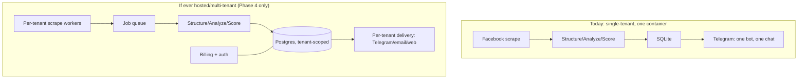

# BE-CarScout — Next Version: From Personal Tool to Sellable Product

This is a planning document, not a build log (that's [Project.md](Project.md)). It's honest
about where the system is weak today and what it would actually take to make it (a) a
robust, production-grade AI system and (b) something you could sell, in that order —
"ready for sale" without "robust" first just means selling something that breaks.

## Read this part first: the biggest blocker isn't engineering

Right now this is a personal tool: one user, one Facebook account, one Telegram bot,
scraping Marketplace for your own use. That's a defensible personal/research use.
**Turning it into a product you sell to other people is a different legal situation, not
just a bigger deployment**, and it needs to be resolved *before* any of the engineering
work below is worth doing:

- **Scraping Facebook Marketplace commercially is high-risk.** Facebook actively detects
  and blocks automated access, and has pursued legal action against scrapers before
  (Meta v. Bright Data and similar cases). Doing this at personal scale, occasionally, for
  your own car search is very different from operating it as a paid service for many
  users hitting Facebook's infrastructure continuously. Realistic options, roughly in
  order of how defensible they are:
  1. **Keep it personal-use / open-source, don't sell direct access to scraped Facebook
     data.** You can sell the *software* (self-hosted, BYO-account) rather than a hosted
     service that scrapes on customers' behalf — the customer scrapes their own account,
     same as you do today. Shifts liability to each user, same as it already sits with
     you now.
  2. **Browser-extension model**: ship a browser extension that runs in the *user's own*,
     already-logged-in browser session. It's still "scraping," but it's the user's own
     browsing activity under their own account, not your infrastructure making
     unauthenticated bulk requests. Meaningfully different risk profile.
  3. **Official/licensed data instead of scraping** for the commercial product, and treat
     Facebook coverage as a personal/self-hosted bonus feature, not the core paid product.
  4. **Hosted multi-tenant scraping-as-a-service against Facebook** (the "obvious" SaaS
     architecture) is the version with the most legal exposure and the one I'd get real
     legal advice on before building, not after.
- **GDPR**: scraped listings include real sellers' names, locations, and contact
  intent. Storing and processing that data for a commercial product (versus your own
  private use) puts you inside GDPR's scope for real — a privacy policy, a lawful basis
  for processing, a data retention/deletion policy, and a way to honor a seller's
  deletion request are not optional once money changes hands, especially Belgium-first.
- **2dehands.be scraping** for price comps has the same category of risk, one notch down
  (used for aggregate pricing, not stored per-person, but still unlicensed commercial use
  of their data at volume).

None of this means "don't build it" — plenty of products navigate this. It means: **decide
which model above (or another) you're actually building before investing in
multi-tenant infrastructure**, since the answer changes the architecture. The rest of this
document assumes you've made that call; Phase 2 below is written for the
self-hosted/BYO-account model (option 1) since it's the one that changes the least about
what already works today.

## Where it stands today (baseline)

- Single user, single Facebook account, single Telegram bot, SQLite, one Docker
  container, hardcoded to Belgium. Solid for what it is — see Project.md's
  "Infrastructure" section for what's already been hardened (WAL-mode DB, resilient
  retries, a real feedback listener, per-stage failure isolation).
- Scoring is deterministic and fully auditable (a real strength — most "AI car deal
  finder" side projects are opaque LLM-judgment black boxes; this one explains every
  point). Worth keeping as a differentiator, not something to "upgrade away" into an
  opaque model later.
- No automated CI, partial test coverage (two bug-driven regression suites plus the
  stage-7 additions — most of the pipeline has none), no monitoring/alerting beyond
  reading Docker logs by hand, no schema migrations for the actual current DB model (the
  `alembic.ini`/`migrations/` in the repo are leftovers from the *salvaged, unused* bot
  skeleton — they don't touch `db/models.py` at all).

## Phase 1 — Make what exists genuinely robust (do this regardless of Phase 2/3)

This is the "robust AI system" half of the ask, independent of selling anything.

**Testing & CI**
- Add tests for the stages that still have none: scraper parsing logic (the pure
  functions, not live Facebook calls), the analyzer's schema handling and retry logic
  (mock the Mistral client), `db/repository.py`'s query logic, and the LangGraph
  `graph.py` nodes themselves (currently only `memory.py`'s pure `_describe()` is
  tested — the graph's routing logic and report-writing aren't).
- Wire up GitHub Actions: run `uv run pytest` on every push/PR. Trivial to add, currently
  doesn't exist, so nothing stops a regression from reaching `main` today.
- A small "golden set" of real scraped listings with hand-verified expected structurer/
  analyzer output, run as a regression suite — turns "spot-checked against 5 real
  listings" (current state per Project.md stage 3) into an actual measured accuracy
  number you can track over time.

**Observability**
- Structured logging (JSON logs) instead of plain text, so failures are queryable instead
  of grep'd by hand.
- Log rotation for `data/pipeline.log` / `data/feedback_listener.log` — both grow
  unbounded today (documented as a known gap since the Docker work).
- An actual alert when a pipeline run fails outright or a stage's failure rate spikes —
  today you only find out by reading logs. Even a "pipeline failed" message to a second,
  admin-only Telegram chat would close this gap cheaply.
- Basic metrics: listings scraped/scored/notified per run, over time — right now this
  only exists as scattered log lines, not anything you could chart.

**Schema & data integrity**
- Real Alembic migrations pointed at `db/models.py`'s actual schema (`ListingRow`) — right
  now, changing a column means editing the model and either wiping the DB or hand-editing
  SQLite. Fine solo; not fine even for a second self-hosted instance, let alone customers.
- A documented backup story for `data/becarscout.db` and `data/mem0/` — currently neither
  is backed up; a container/host failure loses the login session (recoverable by
  re-logging in), the DB (loses history), and all feedback memory (loses the personalization
  this session just built).

**Scraper resilience** (the part most exposed to breaking silently)
- Facebook's markup changes over time — the scraper leans on structural hooks (link
  hrefs, last-`<h1>`, span ordering) specifically to reduce this, but there's no automated
  "did the scraper actually get real data or silently get zero results" check. A cheap
  win: alert if a scrape run returns 0 new listings for N runs in a row (almost certainly
  a broken selector, not actually zero new cars in Belgium).
- Detail-page fetching is still sequential (documented limitation since stage 1) —
  fine at ~50-100 listings/hour, but worth revisiting with bounded concurrency
  (e.g. 3-5 parallel tabs) if search radius/hub count grows.

## Phase 2 — Product functionality (assuming the BYO-account / self-hosted model)

What turns "a script I run" into "a product someone else can use without reading the
code":

- **A real setup wizard**, replacing manual `.env` editing: a CLI (`becarscout init`) or a
  minimal local web page that walks through Mistral key, Telegram bot creation, search
  region/radius, price range, and make/model preferences, and writes the config.
- **Search profiles, not one hardcoded search.** Right now Belgium/5 hubs/vehicles is
  baked into `scraper/belgium.py`. A real product needs per-installation config: country,
  hub cities (or a lat/lon + radius), category (not just cars, if you ever widen scope),
  price band, and multiple concurrent saved searches (e.g. "family SUV under €15k" and
  "project car under €3k" at once) rather than one global search.
- **A small local web dashboard** (even a single-page app served by the same container)
  instead of Telegram-only: view scored listings and their full reasoning trail, adjust
  the score threshold, see the feedback-review reports (`data/feedback/review_*.md`)
  rendered nicely instead of as raw markdown, and — this is the one that actually uses
  stage 7's work — a one-click "apply this suggested weight change" button that edits
  `scoring.py`'s constants for you (still a deliberate, visible action, not silent
  auto-tuning; keeps the human-in-the-loop principle from stage 7's design).
- **Telegram bot commands** (raised in the last conversation, not yet built): `/status`
  (last run time, listings found), `/pause` / `/resume`, `/threshold <n>`, `/score <url>`
  for on-demand scoring of a single link outside the hourly cycle. Cheap to add — see
  `notifier/bot.py`'s `run_feedback_listener`, just needs `CommandHandler`s registered
  alongside the existing `CallbackQueryHandler`.
- **Packaging**: a one-line install path (a published Docker image + a `docker-compose.yml`
  template someone can `curl` and run, rather than cloning the whole repo) if this is
  going to be self-hosted by non-developers.

## Phase 3 — What would make it worth paying for (differentiation)

Being "an AI car deal finder" isn't unique — Project.md's own prior-art survey found
several similar side projects. What would make this specifically worth money:

- **Scam/fraud detection.** Used-car marketplace scams are common and costly (fake
  listings, "wire the deposit first," stolen photos). A signal-extraction pass (stage 3
  already does structured LLM extraction) could flag common scam patterns explicitly —
  genuinely useful and not something the current design principle (deterministic scoring)
  conflicts with, since "this looks like a scam" is a flag surfaced to the human, not a
  buy/no-buy judgment.
- **Reverse image search on listing photos** — flags stock photos or photos reused across
  many listings (a strong scam signal, and currently invisible: Project.md's stage 6 notes
  photos aren't even included in the Telegram card yet).
- **A real, growing price baseline.** Stage 4's known limitation is depending on a live
  2dehands.be scrape per run. At any real scale (more users, more history), your *own*
  accumulated scrape history becomes a better, more defensible baseline than scraping a
  second site live — this was already flagged as v4 in Project.md's roadmap; it becomes
  much more valuable (and lower-risk) the moment there's real product volume.
- **VIN/history lookups** where available for the Belgian market (accident history,
  odometer-rollback flags) — real differentiation from a plain price/condition scorer,
  though it depends on finding a legitimately licensable BE/EU data source.
- **Multi-channel delivery** (email/WhatsApp/push, not just Telegram) — Telegram is a fine
  personal choice but a real barrier for a general audience.
- **An actual measured track record**: "opportunities we've flagged that you bought and
  what happened" turns this from a filter into a testimonial engine, which is what
  actually sells a product like this.

## Phase 4 — Only relevant if you do go multi-tenant/hosted

Skip this section entirely unless you've resolved the legal question above in favor of a
hosted, multi-tenant service. If you do:

- Postgres instead of SQLite (SQLite's WAL mode fix from this session handles two
  processes in one container; it does not handle many customers' worth of concurrent
  writes).
- A real job queue (Celery/RQ/similar) instead of one cron tick per container — scraping
  many customers' search profiles needs to be distributed and rate-limited independently
  per Facebook account/session, not run serially in one process.
- Auth, billing (Stripe), usage metering (Mistral/scraping cost scales per customer —
  needs to be tracked and either capped or priced in).
- Per-tenant isolation for the DB, the mem0 feedback memory (already namespaced by
  `user_id` in `feedback_agent/memory.py` — currently hardcoded to `"owner"`, which is the
  one piece of stage 7 that would need to change first, swapping in a real per-account id).
- An admin/ops dashboard: pipeline health across all tenants, error rates, cost per
  tenant.
- Terms of Service, a real privacy policy, and a support channel — table stakes for
  charging money, not optional polish.

## Suggested order of actual work

1. **Decide the legal/business model** (top of this document) — everything else depends
   on the answer.
2. **Phase 1** regardless of that decision — CI, tests, monitoring, migrations, backups.
   This is pure upside with no new risk.
3. If selling self-hosted/BYO-account software: **Phase 2**, then pick 1-2 items from
   **Phase 3** as the actual selling point, not all of them at once.
4. **Phase 4** only after there's a paying self-hosted customer base validating demand —
   building multi-tenant hosting infrastructure before that is the classic way to spend
   months building the wrong thing.

## Open questions that need a product decision, not an engineering one

- Who is the actual customer — an individual car buyer (personal, occasional use, like
  this session) or a small dealer/flipper (frequent use, wants volume and speed over a
  low-noise Telegram alert)? These want almost opposite things (Project.md's own design
  principle is "low noise over completeness" — a dealer might want the opposite).
- Is Belgium-only a permanent scope choice or a v1 constraint? Multi-country support
  means re-doing the make/model/language keyword lists (`structurer/`, `analyzer/schema.py`)
  and the price-baseline source (2dehands.be is Belgium-specific) per country.
- Self-hosted (each customer runs their own container, their own Facebook account) vs.
  hosted (you run it, customers just connect Telegram) — this is really the same question
  as the legal one above, asked from a product angle instead of a legal one.
