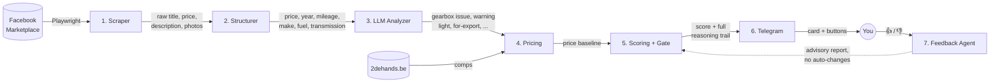
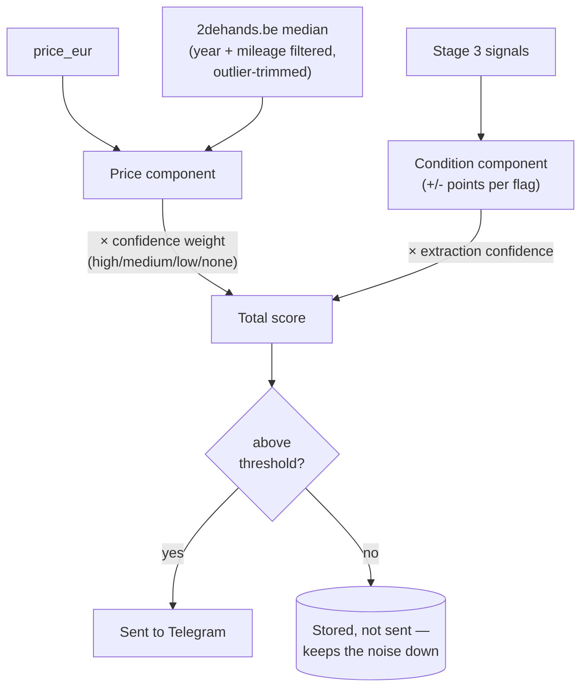
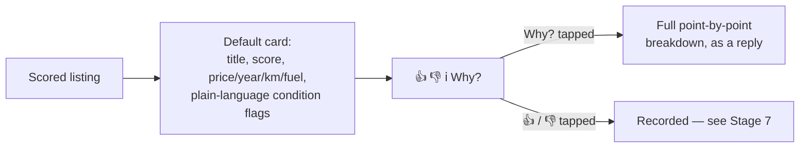
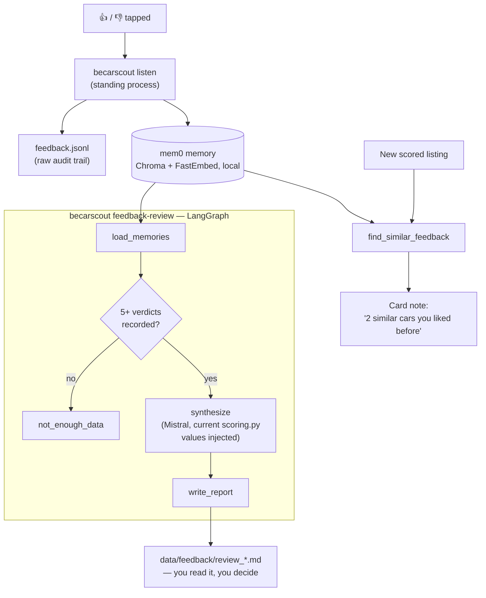
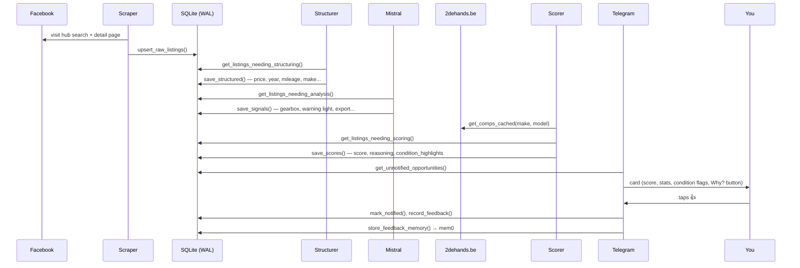
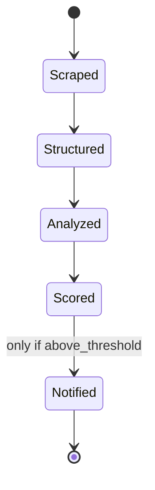
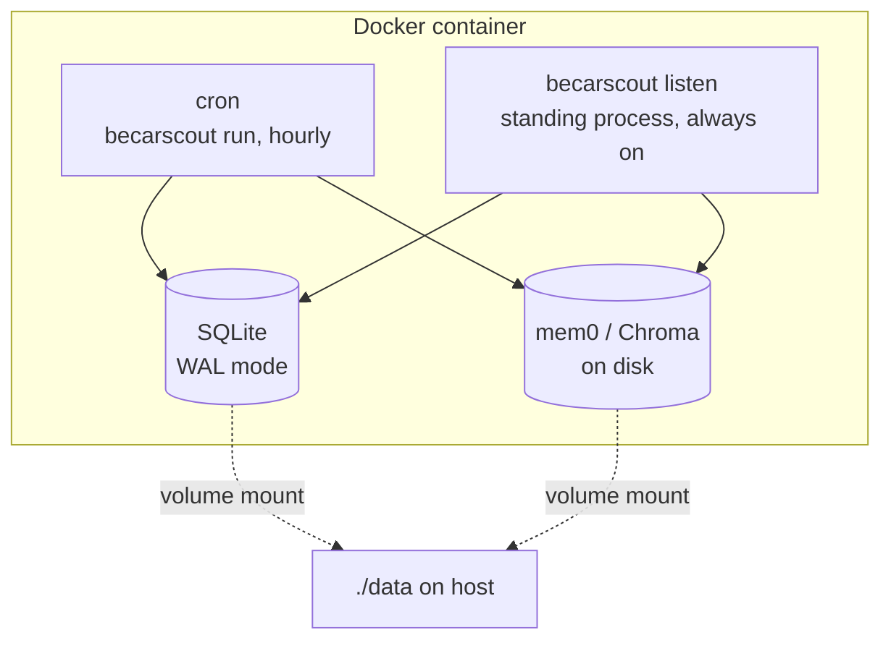

# BE-CarScout — Technical Presentation

A walkthrough of what this system is, how it's built, and why it's built that way. For the
build history and per-stage decisions, see [Project.md](Project.md); for what's next, see
[next_version.md](next_version.md). This document is the "explain it to someone who's
never seen the code" version.

## 1. The problem, in one paragraph

Facebook Marketplace has good used-car deals buried in noise: bad prices, "for parts"
listings mislabeled as running, vague descriptions hiding real mechanical issues, and far
too much volume to scroll manually. A plain price/mileage filter is too dumb to catch the
good stuff, but you also can't just point an LLM at a listing and ask "is this a good
deal?" — it hallucinates and has no consistent standard from one listing to the next. So
the system splits the work the way a careful human would: **extract facts → understand
the free text → score against the real market → only interrupt you when something's
actually worth a look.**

## 2. The pipeline, end to end

Six stages run automatically, hourly, unattended. The seventh is a standing process plus
a command you run manually when you want it. Nothing in stages 1–5 is an LLM making a
buy/no-buy call — only stage 3 uses an LLM at all, and its only job is turning free text
into structured facts. The actual judgment (is this a good deal) is stage 5: plain
arithmetic, fully explainable.

## 3. Stage by stage

### Stage 1 — Scraper
Playwright drives a real, already-logged-in Chromium session (the login form is never
automated — that's the fastest way to get an account flagged). Facebook's search is
radius-based from one point, not country-based, so Belgium coverage comes from fanning
out over 5 hub cities and deduplicating by listing id. The search-results grid turns out
to expose almost nothing useful (no title, even) — so it's used purely for link discovery,
and every listing gets its own detail-page visit for the real title, price, description,
and photos, extracted via `trafilatura` to strip Facebook's page boilerplate.

### Stage 2 — Structurer
Pure regex/keyword parsing, no LLM: price, year, mileage, make, fuel type, transmission,
location, listing age. Each field is a standalone, individually-testable function —
deliberately dumb and auditable, because a regex pass shouldn't try to be a car database.
What it can't reliably get (make/model spelled out, mileage phrased unusually, fuel type
buried in slang) is exactly the gap stage 3 exists to close.

### Stage 3 — LLM Analyzer
The one place an LLM (Mistral) touches this pipeline. Given a title + description, it
returns **structured fields, not an opinion** — a strict JSON schema forces this: warning
lights, gearbox/engine issues (with severity), accident damage, timing belt replacement,
Belgian roadworthiness inspection status (*keuring*/*contrôle technique*), service history,
export intent, VAT scheme. It never says whether the car is a good deal.

### Stage 4/5 — Pricing + Scoring + Gate

The price side compares the asking price against a **live median from 2dehands.be**
(Belgium's major classifieds site — chosen after two other sites hard-blocked automated
access), filtered down to genuinely comparable cars: same year band (cascading ±2 → ±4 →
±8 years — never falling back to an unfiltered pool, so a 1986 classic never gets priced
against a modern high-trim version of "the same" model), similar mileage, and outliers
trimmed if the surviving pool still spans more than 5x between cheapest and priciest.

The condition side applies named point weights (`scoring.py` — every weight lives at the
top of one file, nothing buried in logic) for each stage-3 flag, then both sides are
scaled down when the underlying data is thin (few comps, or a description the LLM wasn't
confident about). Every point is named in a reasoning trail — nothing gets flagged without
an explanation that traces back to a specific field.

### Stage 6 — Telegram delivery
Two layers, not one wall of text:

The default card reads like a person describing the car ("⚠️ Warning light mentioned",
"✅ New timing belt"); the numbers behind those flags are one tap away, not forced on you
up front.

### Stage 7 — Feedback Agent (mem0 + LangGraph)

Every 👍/👎 is stored twice: as a flat, append-only audit log (`feedback.jsonl`) and as a
**semantically searchable memory** in mem0 (fully local — Chroma vector store on disk,
FastEmbed for embeddings, no OpenAI key, no data leaving the machine). That second form is
what lets a brand-new listing get checked against everything you've rated before, and lets
`becarscout feedback-review` — a small LangGraph agent — periodically turn accumulated
verdicts into a plain-English report of patterns plus concrete suggested `scoring.py`
weight changes. It is deliberately **advisory only**: it never edits `scoring.py` or
changes what gets sent to Telegram. Same "LLM interprets, a human/deterministic step
judges" principle as stage 3, just applied one level up — patterns across many verdicts,
instead of facts within one description.

## 4. One listing's full journey

Every arrow into "DB" is a plain `WHERE <stage>_at IS NULL` query — this is what makes the
hourly cron run cheap. A listing scraped and processed last hour is never re-sent to
Mistral, re-scraped for comps, or re-scored; only genuinely new work happens each tick.

One denormalized table (`listings`), one row per listing, gaining columns as it moves
right — not five separate tables with joins, since at personal-project scale that would
add complexity for no real benefit.

## 5. Infrastructure — two processes, one container

Two long-lived processes now run concurrently in the same container: the hourly pipeline
and the standing feedback listener (a real gap found and fixed this session — the listener
existed in code but was never actually started in the container, so button presses were
silently going nowhere until that was wired into `entrypoint.sh`). Because they're
genuinely concurrent now, SQLite runs in **WAL mode** with a busy-timeout, so a reader and
a writer don't block each other and a real write collision retries briefly instead of
failing immediately.

## 6. Design principles (the "why" behind the choices above)

- **LLM does interpretation, never judgment.** Free text → structured facts is the one
  thing worth an LLM; buy/no-buy scoring stays deterministic and inspectable. This applies
  at both levels of the system now — stage 3 (per listing) and stage 7 (across many
  verdicts).
- **Everything flagged is traceable** to a specific phrase or field — no unexplained
  scores, which is exactly why the "Why?" button exists: the explanation was always
  computed, it just used to be forced on you instead of offered.
- **Low noise over completeness.** Better to miss a borderline listing than erode trust in
  the alerts — the whole point of the decision gate.
- **Belgium-first**, not Belgium-only by accident: the market model, language handling
  (NL/FR/mixed), and paperwork terms (*keuring*, BTW/margin scheme) are tuned for one
  country deliberately, before ever considering generalizing.

## 7. Tech stack

| Layer | Choice | Why |
|---|---|---|
| Scraping | Playwright (Python) | Real browser, handles a JS-heavy site; persistent login profile avoids re-authenticating |
| Content extraction | `trafilatura` | Strips Facebook's page boilerplate without hand-picking brittle CSS selectors |
| Structured extraction | Mistral (`mistralai` SDK), strict JSON schema | User's explicit choice over Claude/GPT; strict schema forces facts, not prose |
| Price comps | 2dehands.be scrape, 7-day disk cache | Two other sites (AutoScout24.be, Gocar.be) hard-blocked automated access |
| Persistence | SQLite (WAL mode), SQLAlchemy | Sufficient at personal-project scale; keeps deployment to one container |
| Scoring | Plain Python, no ML | Deterministic and auditable by design — see principles above |
| Delivery | `python-telegram-bot` | Simple push + button-based feedback loop |
| Feedback memory | mem0, local (Chroma + FastEmbed) | Fully local, no OpenAI key; `litellm` lets it use Mistral instead |
| Feedback agent | LangGraph | Small, explicit graph (load → branch on volume → synthesize → report) |
| Scheduling | cron inside the container | Real cron, not a Python sleep loop — survives independent of the app process |
| Tests | pytest | Added alongside the first real bugs found — regression coverage grows with incidents, not upfront |

## 8. Built by finding real bugs, not just by inspection

A theme worth calling out explicitly: nearly every hardening step in this system came from
**running it against real data and finding it broken**, not from anticipating problems in
the abstract:

- A mixed-era comp pool silently priced a 1986 classic truck against modern high-trim
  versions of "the same" model — found by auditing real Telegram output against the actual
  market, fixed by never letting the year filter fall back to an unfiltered pool.
- A regex bridged two unrelated pieces of Facebook's own page text across a newline,
  extracting a sidebar listing's price as a car's mileage — found the same way, fixed by
  tightening the pattern and adding a plausibility safety net.
- The feedback listener existed in code but was never actually started in the deployed
  container — 👍/👎 taps were silently going nowhere until this was caught and fixed.
- A live Telegram `TimedOut`, a Docker build-layer ordering bug, and a secret accidentally
  echoed by `docker compose config` were all caught by actually deploying and watching it
  run, not by code review alone.

This isn't incidental — it's the reason the system is trustworthy today: every fix above
is backed by a real, previously-wrong observed behavior and (where practical) a regression
test using the actual data that broke it.
